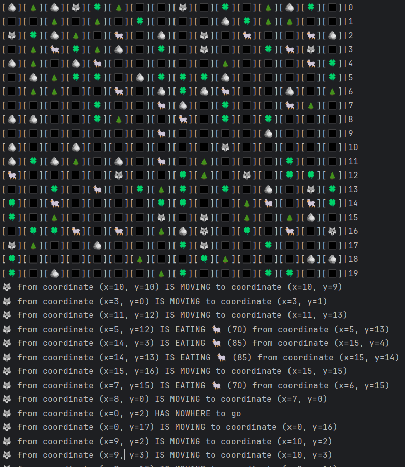

# Simulation

Created according to technical specification presented in [this course](https://zhukovsd.github.io/java-backend-learning-course/Projects/Simulation/).

# Overview

The point of the project is a step-by-step simulation of a 2D world populated by herbivores and predators. In addition
to creatures, the world contains resources (grass), which the herbivores feed on, and static objects with which you
can't interact - they just fill the space.

### Features:

- Creature actions:
    - `Herbivores` can either go towards the `Grass` or eat it
    - `Predators` can either go towards the `Herbivores` or eat them
    - [Breadth-first search](https://en.wikipedia.org/wiki/Breadth-first_search) used as pathfinding algorithm
    - algorithm excludes stationary (`Tree` & `Rock`) objects from pathfinding
    - `Renderer` displays the current state of the simulation in the console output
    - if a `Creature` has nowhere to go(blocked) it will start to starve(loose life) and eventually die 
- Logging:
    - Logging: each `Predator's` movement gets printed in the console at each round
- Static Entities
    - `Rock` & `Tree` are static entities, they only take space and so nothing

### In order to run the program execute these commands in order:
- git clone https://github.com/WillSalas2002/Simulation-Pet-2-
- git clean package
- java -jar simulation-1.0-SNAPSHOT.jar